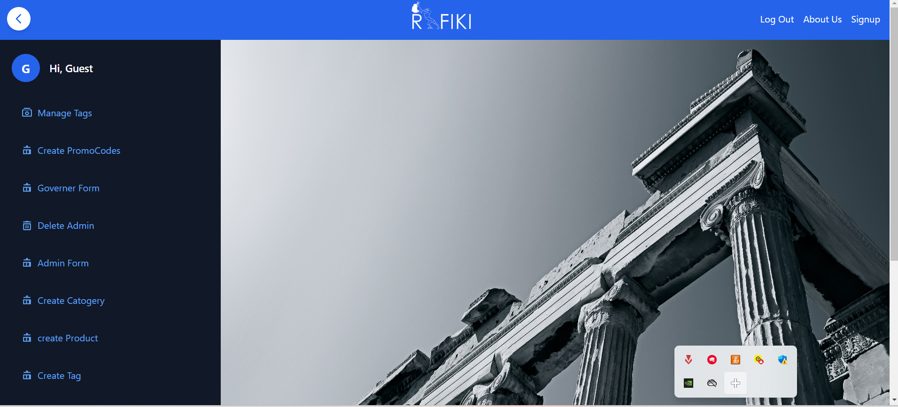
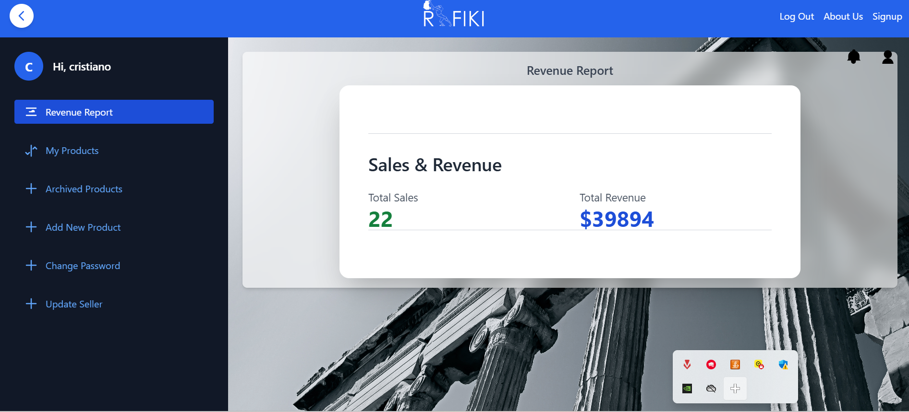
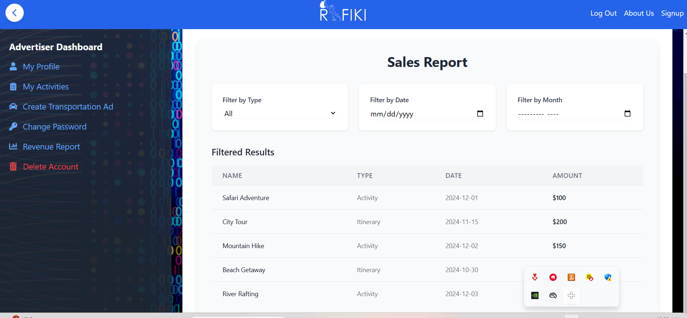
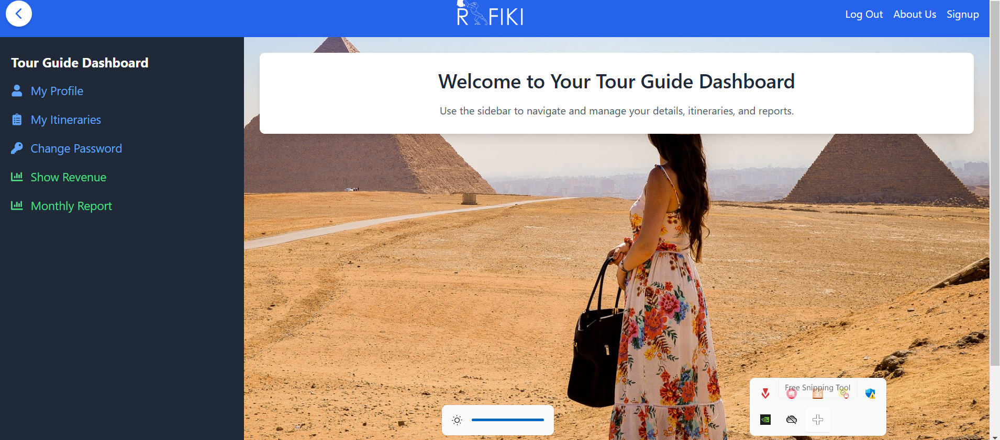

# Rafiki

A little brief about what the project is about.  
**Rafiki** is a traveling agency that connects travelers, tourists, and explorers with trusted tour guides, curated activities, and engaging experiences worldwide. Our platform empowers users to discover new places, learn about cultures, and create lasting memories.


## Motivation

The inspiration behind **Rafiki** stems from the desire to make travel more accessible, enjoyable, and meaningful. Many travelers struggle to find reliable information, trusted guides, and authentic experiences while exploring new destinations. **Rafiki** aims to bridge this gap by connecting users with knowledgeable tour guides and curated activities, helping them immerse themselves in diverse cultures and create unforgettable memories. This project was pursued to empower both travelers and local guides, fostering a global community of exploration and connection.


## Build Status
- Provide the current status of the project (e.g., "Complete," "In Progress," "Needs Improvement").
- Include any notable issues or bugs not covered elsewhere in the README.
Current Status: Complete
No Current Bugs

## Code Style

### Frontend Folder Structure
- `src/pages`: Contains all the main pages of the application. Each page corresponds to a route.
- `src/components`: Contains reusable components that are used across the application. These components are added to the pages as needed.
- `src/pics`: Contains all the pictures used in the pages .
- `src/videos`: Contains the main video used for the homepage.


### Backend Folder Structure
- `routes`: Contains API route handlers for different endpoints.
- `models`: Contains Mongoose schemas and models for database interactions.
- `controllers`: Contains logic for handling requests and responses.

This structure ensures the project remains organized and maintainable as it grows.

## Screenshots

Here are some snapshots of the **Rafiki** platform:

.png)



.png)





.png)




## Tech/Framework Used

The **Rafiki** project is built using the **MERN stack**, which includes:

- **MongoDB**: For database management.
- **Express.js**: For building the backend and RESTful APIs.
- **React.js**: For creating the user interface and handling state management.
- **Node.js**: For server-side scripting and application logic.

### Additional Tools and Libraries:
- **CSS**: For styling the user interface.
- **Mongoose**: An Object Data Modeling (ODM) library that allows MongoDB to be used in a more structured way.
- **Stripe**: For handling secure online payments and transactions.
- **CORS**: To enable Cross-Origin Resource Sharing for server and client interaction.
- **bcrypt**: For hashing and securely storing passwords.
- **SweetAlert**: For displaying alerts and notifications in a user-friendly manner.
- **Nodemailer**: For sending transactional emails.
- **fs (file system)**: For handling file operations.
- **Google APIs**: For interacting with Google services like Maps, Places, and OAuth.
- **Passport**: For handling authentication.
- **Multer**: For handling file uploads.
- **React Icons**:
  - `useState`
  - `FaLink`, `FaEnvelope`, `FaEdit`, `FaTrashAlt`, `FaDollarSign`, `FaImage`, `FaFileAlt`, `FaStore`, `FaStar`, `FaCommentDots`, `FaBoxes`, `FaChartLine`, `FaPhone`, `FaGlobe`, `FaBriefcase`, `FaBirthdayCake`, `FaFilePdf`, `FaEye`, `FaTimesCircle`, `FaEye`, `FaChevronDown`, `FaChevronUp`, `FaTrashAlt`, `FaKey`, `FaCar`, `FaKey`, `FaClipboardList`, `FaKey`, `FaCar`, `FaLock`, `FaEdit`, `FaTrash`, `FaSave`, `FaTag`, `FaRegCheckCircle`, `FaExclamationTriangle`, `FaSpinner`, `FaChevronDown`, `FaChevronUp`, `FaTrashAlt`, `FaDollarSign`, `FaImage`, `FaFileAlt`, `FaStore`, `FaStar`, `FaCommentDots`, `FaBoxes`, `FaChartLine`, `FaPhone`, `FaGlobe`, `FaBriefcase`, `FaBirthdayCake`, `FaFilePdf`, `FaEye`, `FaTimesCircle`, `FaEye`, `FaChevronDown`, `FaChevronUp`, `FaTrashAlt`, `FaDollarSign`, `FaImage`, `FaFileAlt`, `FaStore`, `FaStar`, `FaCommentDots`, `FaBoxes`, `FaChartLine`, `FaPhone`, `FaGlobe`, `FaBriefcase`, `FaBirthdayCake`, `FaFilePdf`, `FaEye`, `FaTimesCircle`.

- **Axios**: For making HTTP requests.
- **React Router**: For handling client-side routing (`useNavigate`, `useParams`, `Link`, `useLocation`).
- **React Transition Group (Motion)**: For animating UI components (`AnimatePresence`).
- **React Stripe Elements**: To integrate Stripe for payment processing (`LoadStripe`, `useStripe`, `useElements`).


These technologies work together to create a full-stack application with a smooth integration between the frontend, backend, and database.


## Features

The **Rafiki** project stands out with its comprehensive suite of features designed to enhance the user experience and facilitate travel planning:

1. **User Accounts**:
   - **Registration and Login**: Users can create an account, log in, and manage their profiles.
   - **User Roles**: Different roles (tourists, sellers, advertisers, tourguides) to tailor the experience for each user type.
   

2. **Discover Events**:
   - Users can explore a variety of activities, museum events ,itineraries and experiences tailored to their interests.
   - **Search and Filter**: Advanced search options to find activities, museums, and itineraries and filter them based on your interests from prices , tags ,dates and categories.

    - **Activities**: Explore a lot of activities at you travelling destination including sports activities , concerts and many other events .
    - **Museums**: Explore and learn about museums and cultural institutions available at your travelling destination  .
    - **Itineraries**: Choose your favourite itineraries  with a tourguide and language of your choice  which includes a lot of fun activities, museum visits, and cultural experiences.

3. **Booking and Payments**:
   - **Secure Online Payments**: Integrated Stripe payment gateway for handling transactions securely.
   - **Booking Management**: Tourists can view, modify, and cancel bookings and gain back their refunds in their wallet. Sellers can manage and update their offerings.
   
   - **Points**: Tourists can collect points based on purchases and redeem them to real money in their wallet to use for further purchases.

   - **Rating**: Tourists can rate and leave comments on  their attended activities , itineraries and museums to enhance other users experience.
   - **Notifications**: Alerts for upcoming tours, booking confirmations, and cancellations via email (Nodemailer).


4. **Content Management**:
   - **Admin Dashboard**: Admins can manage tags, governers, products, categories, and more through an intuitive interface.
   - **Governor Profiles**: Governers can create museums , update and delete them based on ticket availability.
   - **Seller Dashboard**: Sellers can create products and do anything related to them in order to sell.
   - **Advertiser Dashboard**: Advertisrs can create and update activities and view the tourists that atended them.
   - **Tour Guide Dashboard**: Tourguides can create itineraries based on the tourists inerests for tourists to attend.


5. **File Handling**:
   - **File Uploads**: Use Multer for handling file uploads for tour documents, photos, and videos.
   - **Document Storage**: Use the file system to store documents securely.


7. **Notifications and Alerts**:
   - **SweetAlert**: Display user-friendly alerts and notifications for various actions within the application.
   - **Email Notifications**: Automate email notifications for bookings, cancellations, and other important updates.

8. **Admin Controls**:
   - **Admin Controls**: Admins can manage the platform, monitor user activity, approve/reject user applications, and view analytics.
   - **gifts**: Admins can create promocodes for tourists to use for discounts in addittion to a special promocode for tourists on his/her bithday.

These features make **Rafiki** a robust platform that connects travelers with trusted guides and curated experiences around the world. The extensive use of libraries, such as Mongoose, CORS, bcrypt, and SweetAlert, further enhances its functionality and ensures a seamless user experience.


## Code Examples

1. **User Accounts**:
   - **Registration and Login**:
     - For detailed implementation, refer to the [Tourist controllers folder](./backend/controllers/TouristController.js) and check the tourist registration and login process.

2. **Discover Events**:
   - Users can explore a variety of activities, museum events, and itineraries tailored to their interests.
   - **Search and Filter**:
     - For filtering events, refer to the Activity/Museum or Itinerary Controllers below and check how the search and filter functionality is implemented.
     - **Activities**:
       - For detailed code, refer to the [Activity controllers folder](./backend/controllers/activityController.js).
     - **Museums**:
       - For detailed code, refer to the [Museum controllers folder](./backend/controllers/museumController.js).
     - **Itineraries**:
       - For detailed code, refer to the [Itinerary controllers folder](./backend/controllers/itineraryController.js).

3. **Booking and Payments**:

 - **Events payment**:
     - For events payment, refer to the [payment controllers folder](./backend/controllers/PController.js) and see the logic for modifying payments.

   - **Booking Management**:
     - For managing bookings, refer to the [Tourist controllers folder](./backend/controllers/TouristController.js) and see the logic for modifying and canceling bookings.
   - **Points**:
     - For redeeming points, refer to the [Redemption controllers folder](./backend/controllers/redemptionController.js).


4. **Admin Controls**:
   - **Admin Controls**:
     - For admin functionality, refer to the [Admin controllers folder](./backend/controllers/adminController.js).
   - **Promotions**:
     - For creating promo codes, refer to the [Promo code controller](./backend/controllers/promocodeController.js).

5. **Products Controls**:
   - **Cart Controls**:
     - For adding products to cart functionality, refer to the [cart controllers folder](./backend/controllers/cartController.js).
   - **Wishlist**:
     - For adding products to wishlist, refer to the [wishlist controller](./backend/controllers/wishlistController.js).


## Installation

To get started with the Rafiki project, follow these steps:

1. **Prerequisites**:
   - Ensure you have Node.js installed. You can download it from [Node.js Official Website](https://nodejs.org/).
   - Make sure MongoDB is installed and running on your system. You can find the installation guide on [MongoDB's official website](https://www.mongodb.com/try/download/community).

2. **Clone the Repository**:
   - Open your terminal.
   - Run the following command to clone the repository:
     ```bash
     git clone https://github.com/yourusername/rafiki.git
     cd rafiki
     ```

3. **Install Dependencies**:
   - Navigate to the project folder:
     ```bash
     cd backend
     ```
   - Install the necessary npm packages:
     ```bash
     npm install
     ```
    - Navigate to the project folder:
     ```bash
     cd frontend
     ```
   - Install the necessary npm packages:
     ```bash
     npm install
     ```

4. **Environment Configuration**:
   - Create a `.env` file in the root of the `backend` folder and add the following environment variables:
     ```plaintext
     PORT=your_port_number
     MONGO_URI=your_mongo_database_uri
     ```
     Replace `your_port_number`, `your_mongo_database_uri`, with your own values.

5. **Setup Database**:
   - If you haven't already done so, initialize the MongoDB database:
     - Start MongoDB:
       ```bash
       mongod
       ```
   - Once MongoDB is running, seed the database:
     ```bash
     npm run seed
     ```

6. **Run and access the Project**:
   - navigate to backend:
     ```bash
     cd backend
     ```
     - run server:
     ```bash
     node server
     ```
   - navigate to frontend:
     ```bash
     cd frontend
     ```
     - run the frontend:
     ```bash
     npm start
     ```


## API References
### Activity Routes

This section describes the available routes for managing activities within the application.

#### Create an Activity
- **URL**: `/api/activityRoute`
- **Method**: `POST`
- **Description**: Create a new activity.
- **Body Parameters**:
  - `name` (string): Name of the activity.
  - `description` (string): Description of the activity.
  - `category` (string): Category of the activity.
  - `budget` (number): Budget required for the activity.
  - `date` (string): Date of the activity.
  - `price` (number): Price of the activity.
  - `tags` (array): Tags associated with the activity.
- **Success Response**: `201 Created`
- **Error Response**: `400 Bad Request`

#### Get All Activities
- **URL**: `/api/activityRoute`
- **Method**: `GET`
- **Description**: Retrieve all activities.
- **Success Response**: `200 OK`
- **Error Response**: `404 Not Found`

#### Get Activity by ID
- **URL**: `/api/activityRoute/:id`
- **Method**: `GET`
- **Description**: Retrieve activity details by ID.
- **Success Response**: `200 OK`
- **Error Response**: `404 Not Found`

#### Update Activity
- **URL**: `/api/activityRoute/:id`
- **Method**: `PUT`
- **Description**: Update an existing activity by ID.
- **Body Parameters**:
  - `name` (string): Updated name of the activity.
  - `description` (string): Updated description of the activity.
  - `category` (string): Updated category of the activity.
  - `budget` (number): Updated budget required for the activity.
  - `date` (string): Updated date of the activity.
  - `price` (number): Updated price of the activity.
  - `tags` (array): Updated tags associated with the activity.
- **Success Response**: `200 OK`
- **Error Response**: `400 Bad Request`

#### Delete Activity
- **URL**: `/api/activityRoute/:id`
- **Method**: `DELETE`
- **Description**: Delete an activity by ID.
- **Success Response**: `200 OK`
- **Error Response**: `404 Not Found`

#### Search Activities by Tag
- **URL**: `/api/activityRoute/searchT/:tag`
- **Method**: `GET`
- **Description**: Search activities by tag.
- **Success Response**: `200 OK`
- **Error Response**: `404 Not Found`

#### Search Activities by Category
- **URL**: `/api/activityRoute/searchC/:category`
- **Method**: `GET`
- **Description**: Search activities by category.
- **Success Response**: `200 OK`
- **Error Response**: `404 Not Found`

#### Filter Activities by Budget
- **URL**: `/api/activityRoute/filter/:budget`
- **Method**: `GET`
- **Description**: Filter activities by budget.
- **Success Response**: `200 OK`
- **Error Response**: `404 Not Found`

#### Filter Activities by Date
- **URL**: `/api/activityRoute/filterDate/:date`
- **Method**: `GET`
- **Description**: Filter activities by date.
- **Success Response**: `200 OK`
- **Error Response**: `404 Not Found`

#### Sort Activities by Price
- **URL**: `/api/activityRoute/sort/price`
- **Method**: `GET`
- **Description**: Sort activities by price in ascending order.
- **Success Response**: `200 OK`
- **Error Response**: `404 Not Found`

#### Add Rating to Activity
- **URL**: `/api/activityRoute/:id/ratings`
- **Method**: `POST`
- **Description**: Add a rating to an activity by ID.
- **Body Parameters**:
  - `rating` (number): Rating value from 1 to 5.
  - `comment` (string): Optional comment on the activity.
- **Success Response**: `201 Created`
- **Error Response**: `400 Bad Request`

#### Get Activity Ratings
- **URL**: `/api/activityRoute/:id/ratings`
- **Method**: `GET`
- **Description**: Get all ratings for an activity by ID.
- **Success Response**: `200 OK`
- **Error Response**: `404 Not Found`

#### Get Activity Price by ID
- **URL**: `/api/activityRoute/price/:activityId`
- **Method**: `GET`
- **Description**: Get the price of an activity by its ID.
- **Success Response**: `200 OK`
- **Error Response**: `404 Not Found`


### Advertiser Routes

This section describes the available routes for managing advertisers within the application.

#### Create an Advertiser
- **URL**: `/api/AdvertiserRoute`
- **Method**: `POST`
- **Description**: Create a new advertiser with a profile picture upload.
- **Body Parameters**:
  - `name` (string): Name of the advertiser.
  - `username` (string): Username of the advertiser.
  - `email` (string): Email address of the advertiser.
  - `password` (string): Password for the advertiser's account.
  - `profilePicture` (file): Profile picture file for the advertiser.
- **Success Response**: `201 Created`
- **Error Response**: `400 Bad Request`

#### Update Advertiser
- **URL**: `/api/AdvertiserRoute/:id`
- **Method**: `PUT`
- **Description**: Update an advertiser's details by ID.
- **Body Parameters**:
  - `name` (string): Updated name of the advertiser.
  - `username` (string): Updated username of the advertiser.
  - `email` (string): Updated email address of the advertiser.
  - `password` (string): Updated password for the advertiser's account.
  - `profilePicture` (file): Updated profile picture file for the advertiser.
- **Success Response**: `200 OK`
- **Error Response**: `400 Bad Request`

#### Get Advertiser by ID
- **URL**: `/api/AdvertiserRoute/:id`
- **Method**: `GET`
- **Description**: Retrieve a single advertiser by ID.
- **Success Response**: `200 OK`
- **Error Response**: `404 Not Found`

#### Get Advertiser by Username
- **URL**: `/api/AdvertiserRoute/username/:username`
- **Method**: `GET`
- **Description**: Retrieve an advertiser by username.
- **Success Response**: `200 OK`
- **Error Response**: `404 Not Found`

#### Get All Advertisers
- **URL**: `/api/AdvertiserRoute`
- **Method**: `GET`
- **Description**: Retrieve a list of all advertisers.
- **Success Response**: `200 OK`
- **Error Response**: `404 Not Found`

#### Advertiser Login
- **URL**: `/api/AdvertiserRoute/login`
- **Method**: `POST`
- **Description**: Login an advertiser.
- **Body Parameters**:
  - `username` (string): Username of the advertiser.
  - `password` (string): Password for the advertiser's account.
- **Success Response**: `200 OK`
- **Error Response**: `401 Unauthorized`

#### Change Advertiser Password
- **URL**: `/api/AdvertiserRoute/changePassword`
- **Method**: `POST`
- **Description**: Change an advertiser's password.
- **Body Parameters**:
  - `oldPassword` (string): The current password.
  - `newPassword` (string): The new password.
- **Success Response**: `200 OK`
- **Error Response**: `400 Bad Request`

#### Request OTP for Password Reset
- **URL**: `/api/AdvertiserRoute/requestOTP`
- **Method**: `POST`
- **Description**: Send an OTP for password reset.
- **Body Parameters**:
  - `email` (string): Email address of the advertiser.
- **Success Response**: `200 OK`
- **Error Response**: `400 Bad Request`

#### Reset Password
- **URL**: `/api/AdvertiserRoute/resetPassword`
- **Method**: `POST`
- **Description**: Reset password after OTP verification.
- **Body Parameters**:
  - `email` (string): Email address of the advertiser.
  - `otp` (string): OTP received via email.
  - `newPassword` (string): New password for the advertiser.
- **Success Response**: `200 OK`
- **Error Response**: `400 Bad Request`

#### Verify OTP
- **URL**: `/api/AdvertiserRoute/verifyOTP`
- **Method**: `POST`
- **Description**: Verify OTP for password reset.
- **Body Parameters**:
  - `otp` (string): OTP received via email.
- **Success Response**: `200 OK`
- **Error Response**: `400 Bad Request`

#### Request Account Deletion
- **URL**: `/api/AdvertiserRoute/deleteAccount/:id`
- **Method**: `DELETE`
- **Description**: Request account deletion by ID.
- **Success Response**: `200 OK`
- **Error Response**: `404 Not Found`

### Bookmark Routes

This section describes the available routes for managing bookmarks within the application.

#### Add an Item to Bookmarks
- **URL**: `/api/bookmarkRoute`
- **Method**: `POST`
- **Description**: Add an item to the bookmarks for a user.
- **Body Parameters**:
  - `username` (string): Username of the user.
  - `itemId` (string): ID of the item to be bookmarked.
- **Success Response**: `200 OK`
- **Error Response**: `400 Bad Request`

#### Request to be Notified
- **URL**: `/api/bookmarkRoute/request`
- **Method**: `POST`
- **Description**: Request to be notified about updates or changes related to a bookmarked item.
- **Body Parameters**:
  - `username` (string): Username of the user.
  - `itemId` (string): ID of the item.
- **Success Response**: `200 OK`
- **Error Response**: `400 Bad Request`

#### Get All Bookmarks for a User
- **URL**: `/api/bookmarkRoute/:username`
- **Method**: `GET`
- **Description**: Retrieve all bookmarks for a user.
- **Success Response**: `200 OK`
- **Error Response**: `404 Not Found`

#### Remove an Item from Bookmarks
- **URL**: `/api/bookmarkRoute/remove`
- **Method**: `DELETE`
- **Description**: Remove an item from bookmarks.
- **Body Parameters**:
  - `username` (string): Username of the user.
  - `itemId` (string): ID of the item to be removed.
- **Success Response**: `200 OK`
- **Error Response**: `400 Bad Request`


### Cart Routes

This section describes the available routes for managing the cart within the application.

#### Add Product to Cart
- **URL**: `/api/cartRoute`
- **Method**: `POST`
- **Description**: Add a product to the user's cart.
- **Body Parameters**:
  - `username` (string): Username of the user.
  - `productId` (string): ID of the product to be added.
  - `quantity` (number): Quantity of the product.
- **Success Response**: `200 OK`
- **Error Response**: `400 Bad Request`

#### Remove Complete Cart
- **URL**: `/api/cartRoute/`
- **Method**: `DELETE`
- **Description**: Clear all products from the user's cart.
- **Body Parameters**:
  - `username` (string): Username of the user.
- **Success Response**: `200 OK`
- **Error Response**: `400 Bad Request`

#### Get Cart Products
- **URL**: `/api/cartRoute/:username`
- **Method**: `GET`
- **Description**: Retrieve all products in the user's cart.
- **Success Response**: `200 OK`
- **Error Response**: `404 Not Found`

#### Remove Product from Cart
- **URL**: `/api/cartRoute/remove`
- **Method**: `POST`
- **Description**: Remove a specific product from the user's cart.
- **Body Parameters**:
  - `username` (string): Username of the user.
  - `productId` (string): ID of the product to be removed.
- **Success Response**: `200 OK`
- **Error Response**: `400 Bad Request`

#### Update Product Amount in Cart
- **URL**: `/api/cartRoute/updateAmount`
- **Method**: `POST`
- **Description**: Update the amount/quantity of a specific product in the user's cart.
- **Body Parameters**:
  - `username` (string): Username of the user.
  - `productId` (string): ID of the product.
  - `quantity` (number): New quantity.
- **Success Response**: `200 OK`
- **Error Response**: `400 Bad Request`

### Category Routes

#### Create a New Category
- **URL**: `/api/categoryRoutes`
- **Method**: `POST`
- **Description**: Create a new category.
- **Parameters**: `name` (string)
- **Response**: `201 Created` or `400 Bad Request`

#### Get All Categories
- **URL**: `/api/categoryRoutes`
- **Method**: `GET`
- **Description**: Retrieve all categories.
- **Response**: `200 OK` or `404 Not Found`

#### Update a Category
- **URL**: `/api/categoryRoutes/:id`
- **Method**: `PUT`
- **Description**: Update a category by ID.
- **Parameters**: `name` (string, optional)
- **Response**: `200 OK` or `404 Not Found` or `400 Bad Request`

#### Delete a Category
- **URL**: `/api/categoryRoutes/:id`
- **Method**: `DELETE`
- **Description**: Delete a category by ID.
- **Response**: `204 No Content` or `404 Not Found` or `400 Bad Request`

### Complaint Routes

#### Create a New Complaint
- **URL**: `/api/complaintRoute`
- **Method**: `POST`
- **Description**: Create a new complaint.
- **Parameters**: `description` (string), `username` (string)
- **Response**: `201 Created` or `400 Bad Request`

#### Get All Complaints
- **URL**: `/api/complaintRoute`
- **Method**: `GET`
- **Description**: Retrieve all complaints.
- **Response**: `200 OK` or `404 Not Found`

#### Update Complaint Status
- **URL**: `/api/complaintRoute/:id/status`
- **Method**: `PUT`
- **Description**: Update the status of a complaint by ID.
- **Parameters**: `status` (string)
- **Response**: `200 OK` or `404 Not Found` or `400 Bad Request`

#### Update Complaint Reply
- **URL**: `/api/complaintRoute/:id/reply`
- **Method**: `PUT`
- **Description**: Add a reply to a complaint by ID.
- **Parameters**: `reply` (string)
- **Response**: `200 OK` or `404 Not Found` or `400 Bad Request`

#### Get Complaints Sorted by Date
- **URL**: `/api/complaintRoute/sort/date`
- **Method**: `GET`
- **Description**: Retrieve complaints sorted by date.
- **Response**: `200 OK` or `404 Not Found`

#### Search Complaints by Status
- **URL**: `/api/complaintRoute/search/:status`
- **Method**: `GET`
- **Description**: Search complaints by status.
- **Response**: `200 OK` or `404 Not Found`

#### Get Complaints by Username
- **URL**: `/api/complaintRoute/complaints/:username`
- **Method**: `GET`
- **Description**: Retrieve complaints by username.
- **Response**: `200 OK` or `404 Not Found`

### Document Upload Routes

#### Upload a Document
- **URL**: `/api/uploadDocument`
- **Method**: `POST`
- **Description**: Upload a single document file.
- **Parameters**:
  - `file` (file): The document file to upload.
- **Response**:
  - `200 OK`: File uploaded successfully.
  - `400 Bad Request`: No file uploaded or invalid file type.
  - `500 Internal Server Error`: Server error.

#### Get All Uploaded Documents
- **URL**: `/api/uploadedDocuments`
- **Method**: `GET`
- **Description**: Retrieve a list of all uploaded documents.
- **Response**: 
  - `200 OK`: List of files.
  - `500 Internal Server Error`: Unable to scan files.

#### Accept or Reject a Document
- **URL**: `/api/accept-reject`
- **Method**: `POST`
- **Description**: Accept or reject a document based on its name.
- **Parameters**:
  - `name` (string): The name of the document.
  - `action` (string): The action to perform (`accept` or `reject`).
- **Response**:
  - `200 OK`: Document action performed successfully.
  - `500 Internal Server Error`: Failed to process document action.

### Itinerary Routes

#### Create an Itinerary
- **URL**: `/api/creatingitinerary`
- **Method**: `POST`
- **Description**: Create a new itinerary.
- **Response**:
  - `200 OK`: Itinerary created successfully.

#### Get a Specific Itinerary
- **URL**: `/api/itinerary/:id`
- **Method**: `GET`
- **Description**: Retrieve an itinerary by its ID.
- **Response**:
  - `200 OK`: Returns the itinerary details.
  - `404 Not Found`: Itinerary not found.

#### Update an Itinerary
- **URL**: `/api/itinerary/:id`
- **Method**: `PUT`
- **Description**: Update itinerary details.
- **Response**:
  - `200 OK`: Itinerary updated successfully.
  - `404 Not Found`: Itinerary not found.

#### Delete an Itinerary
- **URL**: `/api/itinerary/:id`
- **Method**: `DELETE`
- **Description**: Delete an itinerary.
- **Response**:
  - `200 OK`: Itinerary deleted successfully.
  - `404 Not Found`: Itinerary not found.

#### Get All Itineraries
- **URL**: `/api/`
- **Method**: `GET`
- **Description**: Retrieve all itineraries.
- **Response**:
  - `200 OK`: List of all itineraries.

#### Sort Itineraries by Price
- **URL**: `/api/sort/price`
- **Method**: `GET`
- **Description**: Get itineraries sorted by price.
- **Response**:
  - `200 OK`: Sorted list of itineraries.

#### Filter Itineraries by Budget
- **URL**: `/api/filter/:budget`
- **Method**: `GET`
- **Description**: Get itineraries filtered by budget.
- **Response**:
  - `200 OK`: Filtered list of itineraries.

#### Filter Itineraries by Available Date
- **URL**: `/api/filterDate/:date`
- **Method**: `GET`
- **Description**: Get itineraries filtered by available date.
- **Response**:
  - `200 OK`: Filtered list of itineraries.

#### Filter Itineraries by Language
- **URL**: `/api/filterLanguage/:language`
- **Method**: `GET`
- **Description**: Get itineraries filtered by language.
- **Response**:
  - `200 OK`: Filtered list of itineraries.

#### Add Rating to an Itinerary
- **URL**: `/api/:id/ratings`
- **Method**: `POST`
- **Description**: Add a rating to an itinerary.
- **Parameters**:
  - `id` (number): The ID of the itinerary.
- **Response**:
  - `200 OK`: Rating added successfully.

#### Get Ratings for an Itinerary
- **URL**: `/api/:id/ratings`
- **Method**: `GET`
- **Description**: Get all ratings for an itinerary.
- **Response**:
  - `200 OK`: List of ratings.

#### Toggle Itinerary Active State
- **URL**: `/api/itinerary/:id/toggle-active`
- **Method**: `PUT`
- **Description**: Toggle the active state of an itinerary.
- **Parameters**:
  - `id` (number): The ID of the itinerary.
- **Response**:
  - `200 OK`: Itinerary state changed successfully.


### Museum Routes

#### Create a New Museum
- **URL**: `/api/`
- **Method**: `POST`
- **Description**: Create a new museum.
- **Response**:
  - `200 OK`: Museum created successfully.

#### Get All Museums
- **URL**: `/api/`
- **Method**: `GET`
- **Description**: Retrieve all museums.
- **Response**:
  - `200 OK`: List of museums.

#### Get a Specific Museum
- **URL**: `/api/:id`
- **Method**: `GET`
- **Description**: Get a museum by its ID.
- **Response**:
  - `200 OK`: Returns museum details.
  - `404 Not Found`: Museum not found.

#### Update a Museum
- **URL**: `/api/:id`
- **Method**: `PUT`
- **Description**: Update a museum's details.
- **Response**:
  - `200 OK`: Museum updated successfully.
  - `404 Not Found`: Museum not found.

#### Delete a Museum
- **URL**: `/api/:id`
- **Method**: `DELETE`
- **Description**: Delete a museum.
- **Response**:
  - `200 OK`: Museum deleted successfully.
  - `404 Not Found`: Museum not found.

#### Search Museums by Name
- **URL**: `/api/search/:name`
- **Method**: `GET`
- **Description**: Search for museums by name.
- **Response**:
  - `200 OK`: List of museums matching the name.

#### Search Museums by Tag
- **URL**: `/api/searchT/:tag`
- **Method**: `GET`
- **Description**: Search for museums by tag.
- **Response**:
  - `200 OK`: List of museums matching the tag.

# Tourist Routes

## Create a Tourist
- **POST** `/`
  - **Description**: Create a new tourist.
  - **Request Body**:
    - `username` (string): The tourist's username.
    - `password` (string): The tourist's password.
    - Other fields as required.
  - **Response**: Status 201 and the newly created tourist.

## Update Tourist
- **PUT** `/:id`
  - **Description**: Update tourist information.
  - **Path Parameters**:
    - `id` (string): Tourist ID.
  - **Request Body**:
    - Fields to update.
  - **Response**: Updated tourist information.

## Get Tourist by ID
- **GET** `/:id`
  - **Description**: Get a tourist by their ID.
  - **Path Parameters**:
    - `id` (string): Tourist ID.
  - **Response**: Tourist details.

## Get All Tourists
- **GET** `/`
  - **Description**: Get a list of all tourists.
  - **Response**: List of tourists.

## Change Password
- **POST** `/changePassword`
  - **Description**: Change the tourist's password.
  - **Request Body**:
    - `oldPassword` (string): The old password.
    - `newPassword` (string): The new password.
  - **Response**: Status 200 if successful.

## Attend Activity
- **POST** `/attendActivity`
  - **Description**: Register tourist attendance at an activity.
  - **Request Body**:
    - `activityId` (string): The activity ID.
  - **Response**: Status 200 and the activity details.

## Attend Itinerary
- **POST** `/attendItinerary`
  - **Description**: Register tourist attendance at an itinerary.
  - **Request Body**:
    - `itineraryId` (string): The itinerary ID.
  - **Response**: Status 200 and the itinerary details.

## Purchase Product
- **POST** `/PurchaseProduct`
  - **Description**: Allow a tourist to purchase a product.
  - **Request Body**:
    - `productName` (string): The name of the product.
    - `totalPrice` (number): The total price.
  - **Response**: Status 200 and updated wallet balance.

## Increment Booked Activity
- **PUT** `/:id/inc`
  - **Description**: Increment the count of booked activities for a tourist.
  - **Path Parameters**:
    - `id` (string): Tourist ID.
  - **Response**: Updated tourist details.

## Decrement Booked Activity
- **PUT** `/:id/dec`
  - **Description**: Decrement the count of booked activities for a tourist.
  - **Path Parameters**:
    - `id` (string): Tourist ID.
  - **Response**: Updated tourist details.

## Get Upcoming Paid Activities
- **GET** `/:id/upcoming-paid-activities`
  - **Description**: Get upcoming paid activities for a tourist.
  - **Path Parameters**:
    - `id` (string): Tourist ID.
  - **Response**: List of upcoming paid activities.

## Get Upcoming Paid Itineraries
- **GET** `/:id/upcoming-paid-itineraries`
  - **Description**: Get upcoming paid itineraries for a tourist.
  - **Path Parameters**:
    - `id` (string): Tourist ID.
  - **Response**: List of upcoming paid itineraries.

## Get Past Paid Activities
- **GET** `/:id/past-paid-activities`
  - **Description**: Get past paid activities for a tourist.
  - **Path Parameters**:
    - `id` (string): Tourist ID.
  - **Response**: List of past paid activities.

## Get Past Paid Itineraries
- **GET** `/:id/past-paid-itineraries`
  - **Description**: Get past paid itineraries for a tourist.
  - **Path Parameters**:
    - `id` (string): Tourist ID.
  - **Response**: List of past paid itineraries.

## Login Tourist
- **POST** `/login`
  - **Description**: Authenticate a tourist.
  - **Request Body**:
    - `username` (string): The tourist's username.
    - `password` (string): The tourist's password.
  - **Response**: Status 200 and tourist details if successful.

## Book Activity
- **POST** `/bookActivity`
  - **Description**: Book an activity for a tourist.
  - **Request Body**:
    - `activityId` (string): The activity ID.
    - `touristId` (string): The tourist ID.
  - **Response**: Status 200 and booking details.

## Book Itinerary
- **POST** `/bookItinerary`
  - **Description**: Book an itinerary for a tourist.
  - **Request Body**:
    - `itineraryId` (string): The itinerary ID.
    - `touristId` (string): The tourist ID.
  - **Response**: Status 200 and booking details.

## Cancel Activity Booking
- **POST** `/cancelActivityBooking`
  - **Description**: Cancel an activity booking for a tourist.
  - **Request Body**:
    - `activityId` (string): The activity ID.
    - `touristId` (string): The tourist ID.
  - **Response**: Status 200 and updated booking details.

## Cancel Itinerary Booking
- **POST** `/cancelItineraryBooking`
  - **Description**: Cancel an itinerary booking for a tourist.
  - **Request Body**:
    - `itineraryId` (string): The itinerary ID.
    - `touristId` (string): The tourist ID.
  - **Response**: Status 200 and updated booking details.

## Cancel Museum Booking
- **POST** `/cancelMuseumBooking`
  - **Description**: Cancel a museum booking for a tourist.
  - **Request Body**:
    - `museumId` (string): The museum ID.
    - `touristId` (string): The tourist ID.
  - **Response**: Status 200 and updated booking details.

## Get Upcoming Booked Activities
- **GET** `/:id/upcoming-booked-activities`
  - **Description**: Get upcoming booked activities for a tourist.
  - **Path Parameters**:
    - `id` (string): Tourist ID.
  - **Response**: List of upcoming booked activities.

## Get Upcoming Booked Itineraries
- **GET** `/:id/upcoming-booked-itineraries`
  - **Description**: Get upcoming booked itineraries for a tourist.
  - **Path Parameters**:
    - `id` (string): Tourist ID.
  - **Response**: List of upcoming booked itineraries.

## Send Upcoming Notifications
- **POST** `/sendUpcomingNotifications`
  - **Description**: Send notifications for upcoming activities or itineraries.
  - **Request Body**:
    - `touristId` (string): The tourist ID.
  - **Response**: Status 200 if successful.

## View Wallet Balance
- **GET** `/:touristId/wallet`
  - **Description**: View the tourist's wallet balance.
  - **Path Parameters**:
    - `touristId` (string): The tourist ID.
  - **Response**: Wallet balance.

## Add Address
- **POST** `/:username/addAddress`
  - **Description**: Add a new address for a tourist.
  - **Path Parameters**:
    - `username` (string): The tourist's username.
  - **Request Body**:
    - `address` (string): The new address.
  - **Response**: Status 200 and the added address.

## Get Addresses
- **GET** `/:username/addresses`
  - **Description**: Get all addresses for a tourist.
  - **Path Parameters**:
    - `username` (string): The tourist's username.
  - **Response**: List of addresses.

## Request OTP
- **POST** `/requestOTP`
  - **Description**: Request an OTP for resetting the password.
  - **Request Body**:
    - `username` (string): The tourist's username.
  - **Response**: Status 200 if successful.

## Reset Password
- **POST** `/resetPassword`
  - **Description**: Reset the tourist's password after OTP verification.
  - **Request Body**:
    - `username` (string): The tourist's username.
    - `newPassword` (string): The new password.
    - `otp` (string): The OTP for verification.
  - **Response**: Status 200 if successful.

## Verify OTP
- **POST** `/verifyOTP`
  - **Description**: Verify the OTP for password reset.
  - **Request Body**:
    - `username` (string): The tourist's username.
    - `otp` (string): The OTP to verify.
  - **Response**: Status 200 if successful.


## Tests

This section describes the tests that can be performed on the project. These tests help verify the functionality and correctness of the application.

### Using Postman

Postman is a powerful tool for testing APIs. You can use Postman to perform various tests on your application endpoints to ensure they are working as expected. Below are some concise example tests:

### Example Tests:

1. **Activity Endpoints**:

   - **Create Activity**:
     - **Endpoint**: `/api/activities`
     - **Method**: POST
     - **Request Body**:
       ```json
       {
         "name": "City Tour",
         "description": "Guided tour of the city's historic sites",
         "category": "Sightseeing",
         "price": 50,
         "date": "2024-12-15",
         "tags": ["tour", "historical"]
       }
       ```
     - **Expected Response**: JSON object with the newly created activity details.

   - **Get All Activities**:
     - **Endpoint**: `/api/activities`
     - **Method**: GET
     - **Expected Response**: JSON array of all activities.

   - **Get Activity by ID**:
     - **Endpoint**: `/api/activities/{id}`
     - **Method**: GET
     - **Description**: Replace `{id}` with the actual activity ID.
     - **Expected Response**: JSON object with the activity details.

   - **Update Activity**:
     - **Endpoint**: `/api/activities/{id}`
     - **Method**: PUT
     - **Request Body**:
       ```json
       {
         "name": "Updated City Tour",
         "description": "Guided tour of the city's historic sites with lunch included"
       }
       ```
     - **Expected Response**: JSON object confirming the update.

   - **Delete Activity**:
     - **Endpoint**: `/api/activities/{id}`
     - **Method**: DELETE
     - **Description**: Replace `{id}` with the actual activity ID.
     - **Expected Response**: Confirmation message that the activity has been deleted.

2. **Tourist Endpoints**:

   - **Create Tourist**:
     - **Endpoint**: `/api/tourists`
     - **Method**: POST
     - **Request Body**:
       ```json
       {
         "username": "johndoe",
         "password": "password123",
         "email": "johndoe@example.com",
         "name": "John Doe"
       }
       ```
     - **Expected Response**: JSON object with the newly created tourist details.

   - **Get Tourist by ID**:
     - **Endpoint**: `/api/tourists/{id}`
     - **Method**: GET
     - **Description**: Replace `{id}` with the tourist ID.
     - **Expected Response**: JSON object with the tourist details.

   - **Update Tourist**:
     - **Endpoint**: `/api/tourists/{id}`
     - **Method**: PUT
     - **Request Body**:
       ```json
       {
         "name": "Jane Doe Updated",
         "email": "janedoeupdated@example.com"
       }
       ```
     - **Expected Response**: JSON object confirming the update.

   - **View Wallet Balance**:
     - **Endpoint**: `/api/tourists/{touristId}/wallet`
     - **Method**: GET
     - **Description**: Replace `{touristId}` with the actual tourist ID.
     - **Expected Response**: JSON object with the wallet balance.


## How to Use

To get started with the traveling agency project, follow these steps:

1. **Clone the Repository**:
   - Open your terminal or command prompt.
   - Navigate to the directory where you want to clone the project.
   - Run:
     ```bash
     git clone https://github.com/your-repository-url.git
     ```
   - Change to the project directory:
     ```bash
     cd your-repository-name
     ```

2. **Install Dependencies**:
   - Ensure you are in the project directory.
   - Run:
     ```bash
     npm install
     ```

3. **Set Up Environment Variables**:
   - Create a `.env` file in the root directory.
   - Add:
     ```plaintext
     PORT=your-port-number
     MONGO_URI=your-mongodb-uri
     SECRET=your-secret-key
     ```

4. **Start the Development Server**:
   - Run:
     ```bash
     npm start
     ```
   - Your application should be accessible at `http://localhost:your-port-number`.

5. **Test Endpoints with Postman**:
   - Use Postman to test various API endpoints for managing activities, tourists, bookings, and itineraries.
   - Create and manage activities, book or cancel tours and activities, view wallet balances, and reset passwords through the provided routes.
   - Ensure MongoDB is running and secure environment variables are in place for smooth operation.

## Contribute

Your contributions are welcome and encouraged! No project is perfect, and there’s always room for improvement. Whether you have ideas for new features, bug fixes, or enhancements, your input can help make this project better. Here’s how you can contribute:

1. **Fork the Repository**: 
   - If you find a bug or have an improvement in mind, fork the repository to your own GitHub account.

2. **Make Changes**: 
   - Implement your changes on your fork. Be sure to test thoroughly before submitting a pull request.

3. **Submit a Pull Request**: 
   - Once you’ve made your changes, submit a pull request with a clear description of what you’ve done. 
   - Include information about why the change is needed and how it benefits the project.

4. **Provide Feedback**:
   - If you don’t have code changes but still have feedback or suggestions, feel free to open an issue or discuss them in the project’s GitHub discussions.
   - Constructive feedback is always welcome!

5. **Stay Updated**:
   - Watch the repository for updates and respond to comments on your pull requests or issues. Your participation will help ensure a smooth and productive collaboration.


## Credits

- **OpenAI**: For providing the language model that helped with content generation and answering questions during the development process.
- **Node.js Documentation**: For official documentation and guidelines on setting up and using Node.js effectively.
- **MongoDB**: For the comprehensive guides and tutorials on MongoDB that helped with database setup and management.
- **Postman**: For providing a platform to test and debug API routes and interactions.
- **Stack Overflow and GitHub Discussions**: For community support, where developers and users shared insights, solutions, and code snippets.
- **YouTube Tutorials**: For helpful video guides that explained various aspects of MERN stack development.


## License

This project is licensed under the Apache License 2.0 - see the [LICENSE](LICENSE) file for details.

### Note:
If external libraries or services (e.g., Stripe) are used in the project, such as Stripe API, ensure you comply with their licensing terms and include relevant credits and acknowledgments.

